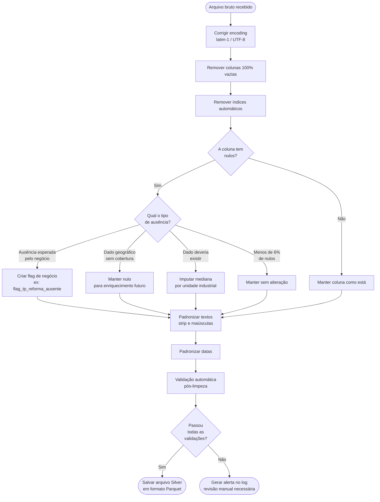
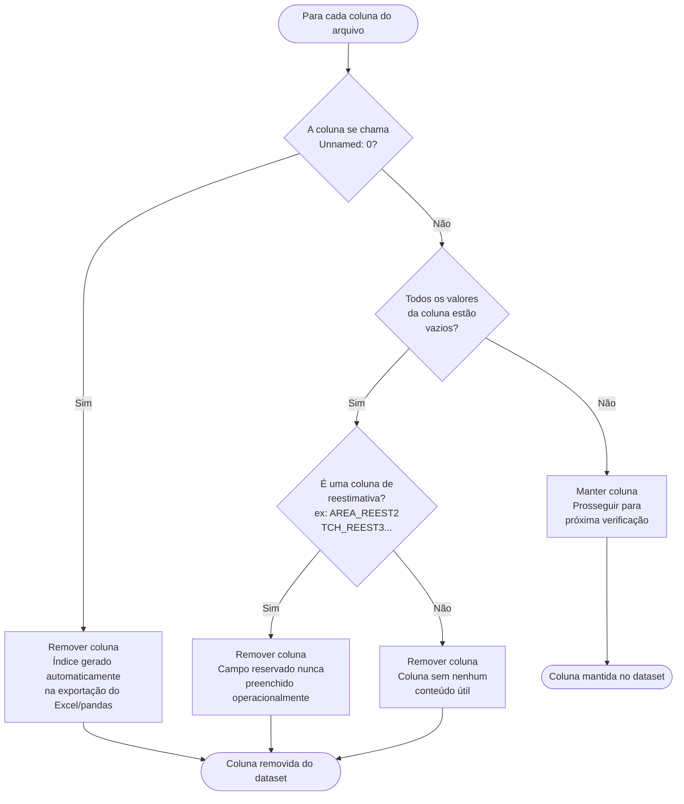
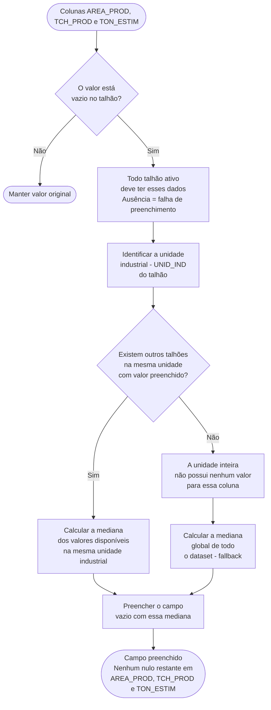
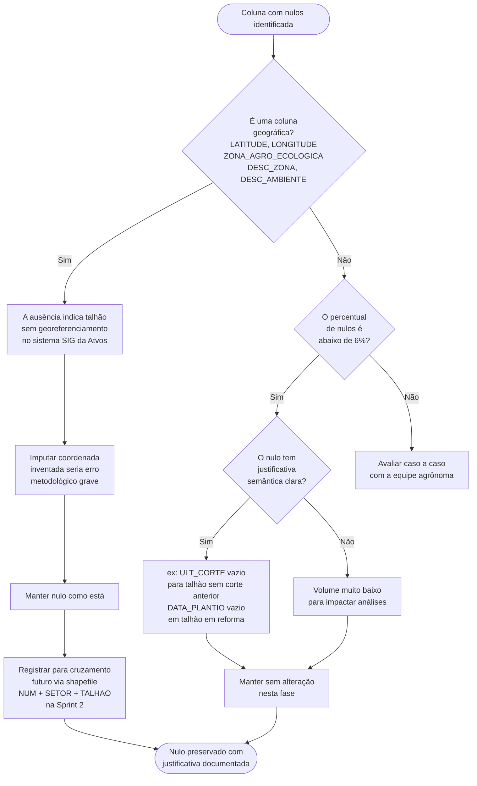
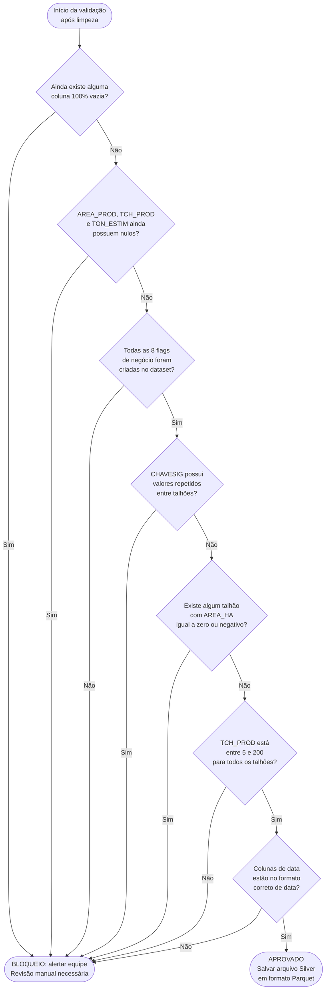
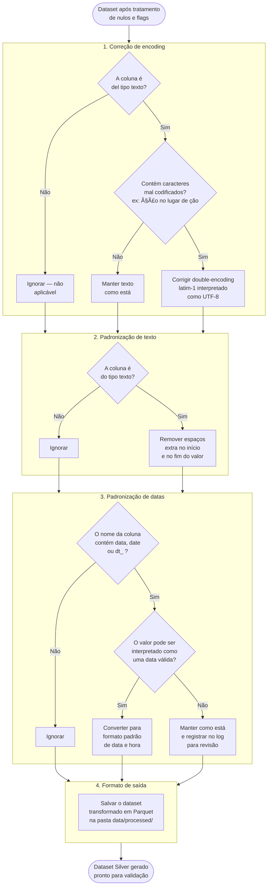
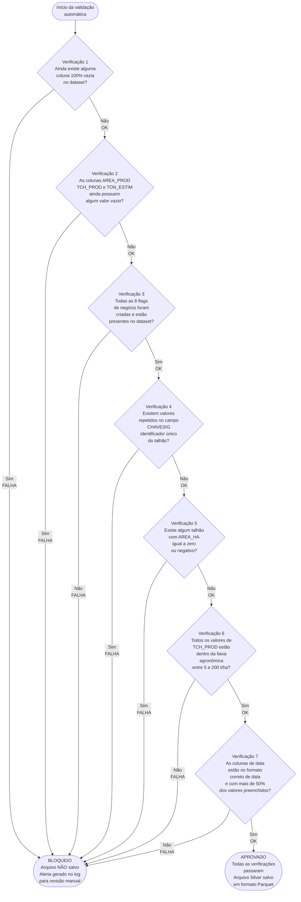

# Mapa Lógico de Regras de Limpeza — Camada Silver

> Losangos = decisões | Retângulos = ações | Círculos arredondados = entradas e saídas.

## Fluxo 1 — Visão geral do processo de limpeza

Mostra a sequência completa de etapas desde o arquivo bruto até o arquivo Silver final em formato Parquet.

---

## Fluxo 2 — Eliminação de colunas

Mostra a lógica para identificar e remover colunas sem conteúdo útil: índices automáticos gerados na exportação e campos de reestimativa que nunca foram preenchidos operacionalmente.

**Colunas removidas nesta etapa:**

| Coluna | Motivo |
|---|---|
| `Unnamed: 0` | Índice automático do pandas |
| `AREA_REEST2`, `TCH_REEST2`, `TON_REEST2` | Campos reservados sem uso (100% vazios) |
| `AREA_REEST3`, `TCH_REEST3`, `TON_REEST3` | Campos reservados sem uso (100% vazios) |

---

## Fluxo 3 — Criação de flags de negócio

Mostra como cada campo com ausência de significado agronômico gera uma flag booleana. Os valores originais **não são alterados** — apenas se torna possível filtrar e consultar essas condições operacionais diretamente.

```mermaid
flowchart TD

    A([Para cada talhão no dataset]) --> B{BLOCO\nvazio?}

    B -- Sim --> B1[flag_bloco_ausente = Verdadeiro\nTalhão sem bloco definido\n23,5% dos casos]

    B -- Não --> B2[flag_bloco_ausente = Falso]

    B1 & B2 --> C{DT_CARACT e\nCARACT vazios?}

    C -- Sim --> C1[flag_caract_ausente = Verdadeiro\nSem registro de\ncaracterização\n99,8% dos casos]

    C -- Não --> C2[flag_caract_ausente = Falso]

    C1 & C2 --> D{CANA_ENT\nvazio?}

    D -- Sim --> D1[flag_cana_ent_ausente = Verdadeiro\nSem entrega de cana\nna safra - 98,9% dos casos]

    D -- Não --> D2[flag_cana_ent_ausente = Falso]

    D1 & D2 --> E{TP_REFORMA\nvazio?}

    E -- Sim --> E1[flag_tp_reforma_ausente = Verdadeiro\nTalhão não passou\npor reforma - 69,3%]

    E -- Não --> E2[flag_tp_reforma_ausente = Falso]

    E1 & E2 --> F{AREA_REEST e TCH_REEST\ne TON_REEST todos vazios?}

    F -- Sim --> F1[flag_reestimativa_ausente = Verdadeiro\nSem reestimativa\nregistrada - 56,2%]

    F -- Não --> F2[flag_reestimativa_ausente = Falso]

    F1 & F2 --> G{AREA_MUDA e TCH_MUDA\ne TON_MUDA todos vazios?}

    G -- Sim --> G1[flag_muda_ausente = Verdadeiro\nTalhão não destinado\nà produção de muda - 94,0%]

    G -- Não --> G2[flag_muda_ausente = Falso]

    G1 & G2 --> H{AREA_COLHIDA\nvazio?}

    H -- Sim --> H1[flag_colheita_ausente = Verdadeiro\nTalhão ainda não\ncolhido - 38,6%]

    H -- Não --> H2[flag_colheita_ausente = Falso]

    H1 & H2 --> I{DATA_FECHA\nvazio?}

    I -- Sim --> I1[flag_talhao_aberto = Verdadeiro\nCiclo ainda em\nandamento - 35,5%]
    
    I -- Não --> I2[flag_talhao_aberto = Falso]

    I1 & I2 --> J([Flags criadas — valores originais\npermanecem inalterados no dataset])
```

**Resumo das flags criadas:**

| Flag | Campos analisados | % Verdadeiro | Interpretação |
|---|---|---|---|
| `flag_bloco_ausente` | `BLOCO` | 23,5% | Talhão sem bloco definido |
| `flag_caract_ausente` | `DT_CARACT`, `CARACT` | 99,8% | Sem registro de caracterização |
| `flag_cana_ent_ausente` | `CANA_ENT` | 98,9% | Sem entrega de cana na safra |
| `flag_tp_reforma_ausente` | `TP_REFORMA` | 69,3% | Talhão sem reforma |
| `flag_reestimativa_ausente` | `AREA_REEST`, `TCH_REEST`, `TON_REEST` | 56,2% | Sem reestimativa registrada |
| `flag_muda_ausente` | `AREA_MUDA`, `TCH_MUDA`, `TON_MUDA` | 94,0% | Não destinado à muda |
| `flag_colheita_ausente` | `AREA_COLHIDA` | 38,6% | Talhão ainda não colhido |
| `flag_talhao_aberto` | `DATA_FECHA` | 35,5% | Ciclo ainda aberto |

---

## Fluxo 4 — Imputação por mediana

Mostra como os campos `AREA_PROD`, `TCH_PROD` e `TON_ESTIM` são preenchidos quando estão vazios. A lógica usa a mediana da própria unidade industrial, evitando distorções entre usinas com perfis de produção muito diferentes.

**Volume de nulos imputados:**

| Coluna | Part 2 | Part 4 | Justificativa |
|---|---|---|---|
| `AREA_PROD` | 14.210 registros | 4.900 registros | Todo talhão ativo deve ter área de produção |
| `TCH_PROD` | 14.210 registros | 4.900 registros | Todo talhão ativo deve ter TCH estimado |
| `TON_ESTIM` | 14.210 registros | 4.900 registros | Derivado de AREA_PROD × TCH_PROD |

---

## Fluxo 5 — Colunas geográficas e nulos residuais de baixo impacto

Mostra a decisão de preservar nulos em campos de coordenadas e zoneamento, e a regra para colunas com poucas ausências.

**Colunas geográficas preservadas:**

| Coluna | % Nulo | Dataset sugerido para cruzamento |
|---|---|---|
| `LATITUDE` | ~18,7% | Shapefile de talhões / IBGE |
| `LONGITUDE` | ~18,7% | Shapefile de talhões / IBGE |
| `ZONA_AGRO_ECOLOGICA` | ~18,0% | Zoneamento agrícola MAPA |
| `DESC_ZONA` | ~18,0% | Par com ZONA_AGRO_ECOLOGICA |
| `DESC_AMBIENTE` | ~35,8% | Dataset de análise de solo |

**Colunas de baixo impacto mantidas sem alteração:**

| Coluna | % Nulo | Decisão |
|---|---|---|
| `AREA_DANO` | ~0,1% | Manter |
| `TIPO_CONTRATO` | ~0,1% | Manter |
| `FORNEC` | ~0,1% | Manter |
| `OBJETIVO` | ~0,5% | Manter |
| `SISTEMA_COL` | ~0,6% | Manter |
| `MAN_HIPOT` | ~2,8% | Manter ("A Definir" é valor operacionalmente válido) |
| `SIST_PLANT` | ~2,8% | Manter |
| `ULT_CORTE` | ~5,5% | Manter (talhões sem corte anterior registrado) |
| `DATA_PLANTIO` | ~10,3% | Manter (talhões em processo de reforma) |

---

## Fluxo 6 — Validação automática pós-limpeza

Mostra as 7 verificações executadas automaticamente antes de salvar o arquivo Silver. Qualquer falha bloqueia a gravação e gera um alerta para revisão manual.

**Checklist de validações:**

| # | Validação | Critério | Resultado esperado |
|---|---|---|---|
| 1 | Nenhuma coluna 100% nula restante | Verificação automática | Nenhuma encontrada |
| 2 | Colunas de imputação sem nulos | `AREA_PROD`, `TCH_PROD`, `TON_ESTIM` | Zero nulos restantes |
| 3 | Todas as flags de negócio presentes | 8 flags obrigatórias | Todas encontradas |
| 4 | `CHAVESIG` sem duplicatas | Identificador único do talhão | Sem repetições |
| 5 | `AREA_HA` > 0 em 100% das linhas | Área do talhão positiva | Sem zeros ou negativos |
| 6 | `TCH_PROD` dentro da faixa agronômica | Entre 5 e 200 t/ha | Todos dentro da faixa |
| 7 | Datas em formato correto | Colunas de data reconhecidas | Formato datetime válido |

---
# Mapa Lógico — Transformações Complementares e Validação Pós-Limpeza

## Fluxo 7 — Transformações Complementares

Mostra as quatro transformações aplicadas sistematicamente a todo dataset durante a geração da camada Silver, independentemente do conteúdo dos campos.

**Resumo das transformações:**

| # | Transformação | O que faz | Quando é aplicada |
|---|---|---|---|
| 1 | Correção de encoding | Corrige textos mal codificados como `ção` → `ção` | Apenas em colunas de texto |
| 2 | Padronização de texto | Remove espaços extras no início e fim dos valores | Apenas em colunas de texto |
| 3 | Padronização de datas | Converte colunas de data para formato padrão `datetime` | Colunas cujo nome contém `data`, `date` ou `dt_` |
| 4 | Formato de saída | Salva o arquivo final em Parquet na pasta `data/processed/` | Sempre, ao final do processamento |

---

## Fluxo 8 — Checklist de Validação Pós-Limpeza

Mostra as 7 verificações executadas automaticamente pelo script `run_processing.py` antes de gravar qualquer arquivo Silver em disco. As verificações são sequenciais: qualquer falha interrompe o processo e gera um alerta no log para revisão manual.

**Checklist detalhado:**

| # | Verificação | O que é checado | Resultado esperado | Se falhar |
|---|---|---|---|---|
| 1 | Nenhuma coluna 100% nula restante | Toda e qualquer coluna do dataset | Nenhuma coluna completamente vazia | Bloqueio + alerta no log |
| 2 | Colunas de imputação sem nulos | `AREA_PROD`, `TCH_PROD`, `TON_ESTIM` | Zero valores vazios restantes | Bloqueio + alerta no log |
| 3 | Todas as flags de negócio presentes | 8 flags obrigatórias | Todas as 8 existem como colunas | Bloqueio + alerta no log |
| 4 | `CHAVESIG` sem duplicatas | Identificador único do talhão | Nenhum valor repetido | Bloqueio + alerta no log |
| 5 | `AREA_HA` positiva em 100% das linhas | Área do talhão em hectares | Nenhum zero ou valor negativo | Bloqueio + alerta no log |
| 6 | `TCH_PROD` dentro da faixa agronômica | Produtividade estimada em t/ha | Todos os valores entre 5 e 200 | Bloqueio + alerta no log |
| 7 | Datas em formato correto | Colunas cujo nome contém `data`, `date` ou `dt_` | Formato `datetime` válido com >50% preenchido | Bloqueio + alerta no log |

