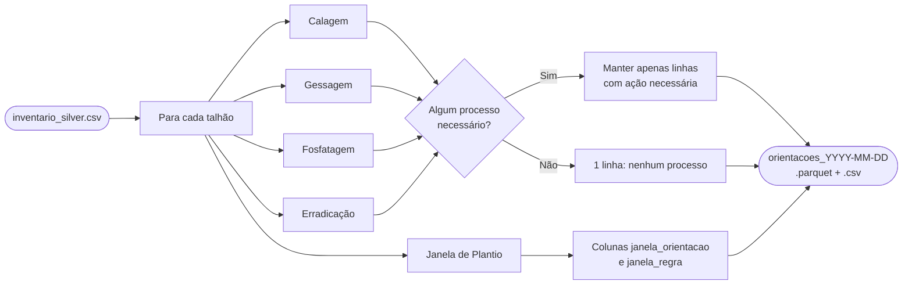
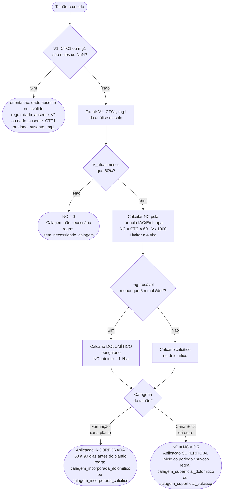
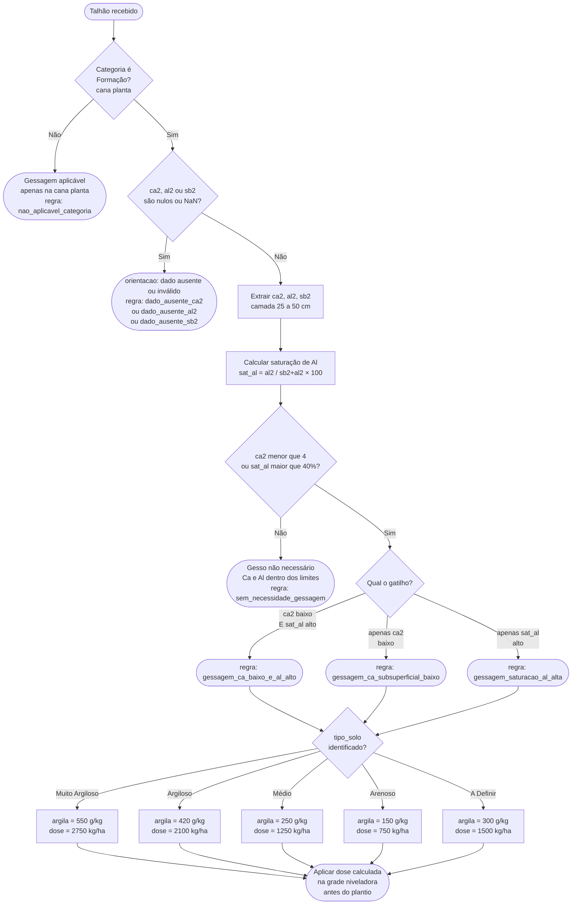
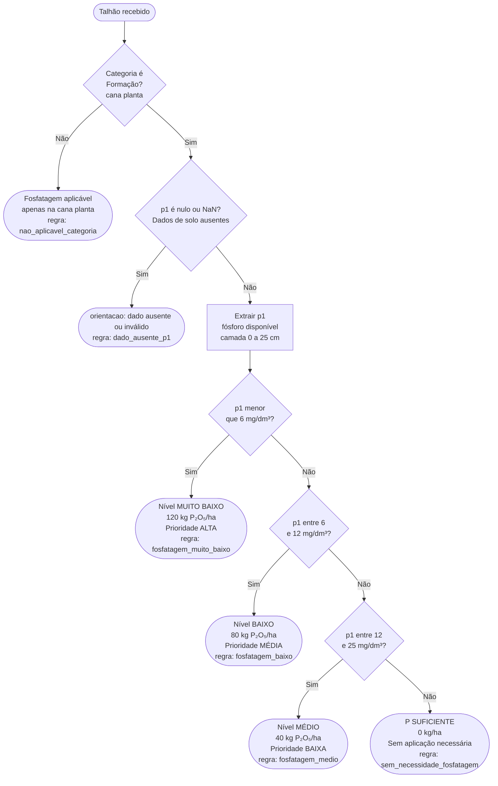
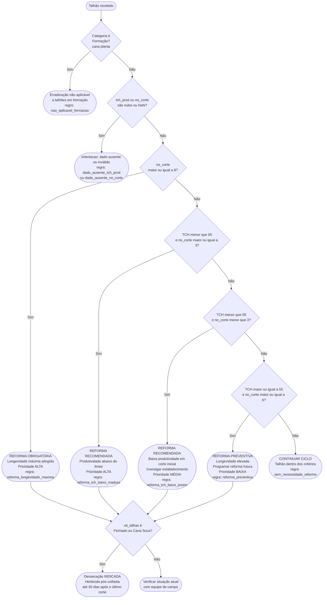
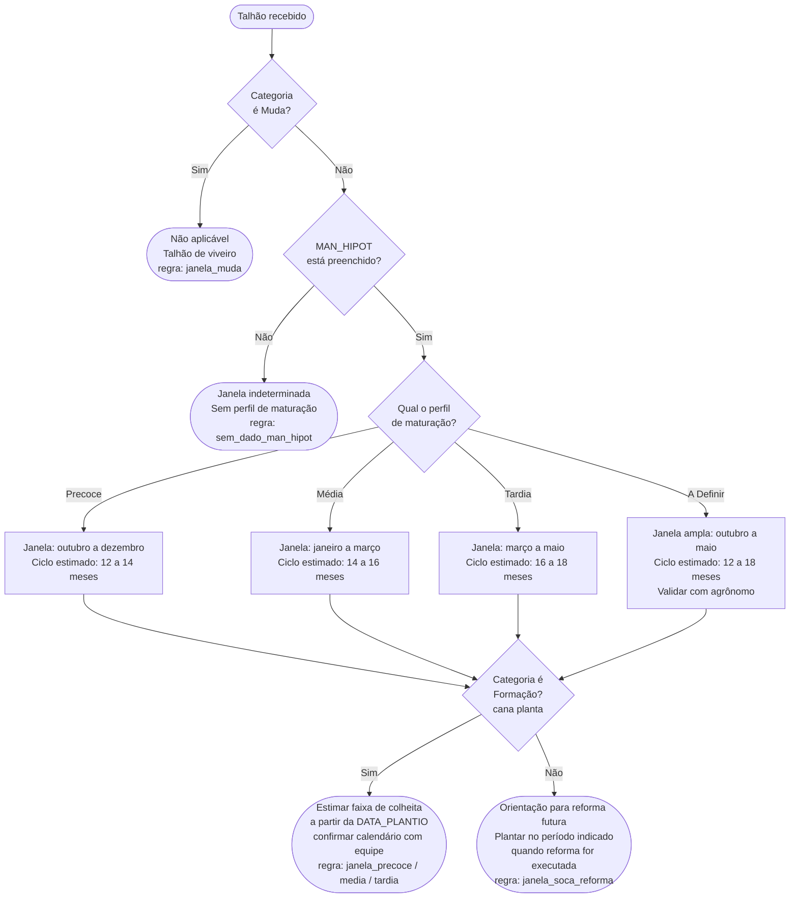

# Motor de Regras Agronômicas — Camada Gold

**Versão:** 2.0  
**Última atualização:** 2026-05-22  
**Responsável:** Atvos G2  
**Relacionado à:** Task 2.5 — Mapa Lógico de Regras

> Losangos = decisões | Retângulos = ações | Círculos arredondados = entradas e saídas.  
> Todos os fluxos recebem um único talhão como entrada e retornam uma **orientação**, um **valor calculado** (quando aplicável) e um **identificador de regra**.

---

## Visão Geral — Pipeline Gold

Para cada talhão do inventário Silver, o pipeline executa os 4 módulos corretivos em sequência. A Janela de Plantio é calculada separadamente e adicionada como colunas ao resultado final.

---

## Schema do Output

O arquivo gerado está em **formato longo**: cada talhão gera entre 1 e 4 linhas, uma por processo com ação necessária.

| Coluna | Tipo | Descrição |
|---|---|---|
| `id_talhao` | string | Identificador único do talhão |
| `unidade` | string | Código da unidade industrial |
| `janela_orientacao` | string | Texto da janela de plantio recomendada |
| `janela_regra` | string | Identificador da regra de janela disparada |
| `data_geracao` | string | Data de geração no formato `YYYY-MM-DD` |
| `processo` | string | `calagem`, `gessagem`, `fosfatagem`, `erradicacao` ou `nenhum processo` |
| `orientacao` | string | Texto da recomendação agronômica |
| `valor_calculado` | float / null | Dose numérica (t/ha ou kg/ha) — apenas calagem e gessagem |
| `regra_acionada` | string | Identificador da regra disparada |

> Linhas com resultado `sem_necessidade_*` ou `nao_aplicavel_*` são suprimidas quando outros processos do mesmo talhão exigem ação. Talhões onde nenhum processo é necessário geram uma única linha com `processo = "nenhum processo"` e `regra_acionada = "sem_necessidade_todos"`.

---

## Processo 1 — Calagem

**Objetivo:** definir a dose e o tipo de calcário para elevar a saturação por bases (V%) do solo a 60%, garantindo disponibilidade de nutrientes para a cana.

**Fórmula:** `NC (t/ha) = CTC × (V_alvo − V_atual) / (PRNT × 10)`

---

## Processo 2 — Gessagem

**Objetivo:** corrigir a subsuperfície do solo (25–50 cm) com gesso agrícola, reduzindo toxidez por alumínio e aumentando cálcio em profundidade.

**Fórmula:** `dose_gesso (kg/ha) = argila (g/kg) × 5`

---

## Processo 3 — Fosfatagem

**Objetivo:** garantir fósforo disponível para a cana planta na fase de enraizamento. Como o fósforo é imóvel no solo, deve ser aplicado diretamente no sulco de plantio.

**Momento de aplicação:** no sulco de plantio (100% da dose) ou pré-plantio incorporado.

---

## Processo 4 — Erradicação de Soqueira

**Objetivo:** identificar talhões de cana soca que devem ser encerrados e reformados, com base na produtividade (TCH) e na longevidade (número de cortes).

---

## Processo 5 — Janela de Plantio *(coluna, não linha)*

**Objetivo:** sugerir o período ideal de plantio (ou replantio em reforma) com base no perfil de maturação da variedade (MAN_HIPOT), visando sincronizar a colheita com os períodos de maior eficiência industrial.

> ⚠️ Este processo **não gera linhas** no output. Seu resultado é adicionado como duas colunas (`janela_orientacao` e `janela_regra`) em todas as linhas do talhão, sejam elas de processos corretivos ou `nenhum processo`.

> ⚠️ **Pendente de validação com PO ATVOS:** os meses sugeridos são baseados no calendário sucroalcooleiro do Centro-Sul do Brasil. Unidades em outras regiões podem ter janelas distintas.

**Tabela-resumo das janelas por perfil:**

| Perfil (MAN_HIPOT) | Janela de Plantio | Ciclo Estimado | Regra |
|---|---|---|---|
| Precoce | Outubro a dezembro | 12–14 meses | `janela_precoce` |
| Média | Janeiro a março | 14–16 meses | `janela_media` |
| Tardia | Março a maio | 16–18 meses | `janela_tardia` |
| A Definir | Outubro a maio (ampla) | 12–18 meses | `janela_a_definir` |

---

## Tabela de Regras — Resumo Geral

| Processo | Regra disparada | Condição | Valor calculado |
|---|---|---|---|
| Calagem | `dado_ausente_V1` | V1 nulo ou NaN | — |
| Calagem | `dado_ausente_CTC1` | CTC1 nulo ou NaN | — |
| Calagem | `dado_ausente_mg1` | mg1 nulo ou NaN | — |
| Calagem | `calagem_incorporada_dolomitico` | V% < 60, cana planta, mg < 5 | NC em t/ha |
| Calagem | `calagem_incorporada_calcitico` | V% < 60, cana planta, mg ≥ 5 | NC em t/ha |
| Calagem | `calagem_superficial_dolomitico` | V% < 60, cana soca, mg < 5 | NC × 0,5 em t/ha |
| Calagem | `calagem_superficial_calcitico` | V% < 60, cana soca, mg ≥ 5 | NC × 0,5 em t/ha |
| Calagem | `sem_necessidade_calagem` | V% ≥ 60 | 0 t/ha |
| Gessagem | `nao_aplicavel_categoria` | Não é Formação | — |
| Gessagem | `dado_ausente_ca2` | ca2 nulo ou NaN | — |
| Gessagem | `dado_ausente_al2` | al2 nulo ou NaN | — |
| Gessagem | `dado_ausente_sb2` | sb2 nulo ou NaN | — |
| Gessagem | `gessagem_ca_baixo_e_al_alto` | Ca < 4 **e** sat Al > 40% | Dose em kg/ha |
| Gessagem | `gessagem_ca_subsuperficial_baixo` | apenas Ca < 4 | Dose em kg/ha |
| Gessagem | `gessagem_saturacao_al_alta` | apenas sat Al > 40% | Dose em kg/ha |
| Gessagem | `sem_necessidade_gessagem` | Ca e Al adequados | 0 kg/ha |
| Fosfatagem | `nao_aplicavel_categoria` | Não é Formação | — |
| Fosfatagem | `dado_ausente_p1` | p1 nulo ou NaN | — |
| Fosfatagem | `fosfatagem_muito_baixo` | P < 6 mg/dm³ | 120 kg P₂O₅/ha |
| Fosfatagem | `fosfatagem_baixo` | 6 ≤ P < 12 mg/dm³ | 80 kg P₂O₅/ha |
| Fosfatagem | `fosfatagem_medio` | 12 ≤ P < 25 mg/dm³ | 40 kg P₂O₅/ha |
| Fosfatagem | `sem_necessidade_fosfatagem` | P ≥ 25 mg/dm³ | 0 kg P₂O₅/ha |
| Erradicação | `nao_aplicavel_formacao` | Categoria = Formação | — |
| Erradicação | `dado_ausente_tch_prod` | tch_prod nulo ou NaN | — |
| Erradicação | `dado_ausente_no_corte` | no_corte nulo ou NaN | — |
| Erradicação | `reforma_longevidade_maxima` | no_corte ≥ 8 | TCH atual |
| Erradicação | `reforma_tch_baixo_maduro` | TCH < 55 e corte ≥ 3 | TCH atual |
| Erradicação | `reforma_tch_baixo_jovem` | TCH < 55 e corte < 3 | TCH atual |
| Erradicação | `reforma_preventiva` | TCH ≥ 55 e corte ≥ 6 | TCH atual |
| Erradicação | `sem_necessidade_reforma` | Dentro dos critérios | TCH atual |
| Janela plantio | `janela_muda` | Categoria = Muda | — |
| Janela plantio | `sem_dado_man_hipot` | MAN_HIPOT nulo | — |
| Janela plantio | `janela_precoce` | MAN_HIPOT = Precoce | — |
| Janela plantio | `janela_media` | MAN_HIPOT = Média | — |
| Janela plantio | `janela_tardia` | MAN_HIPOT = Tardia | — |
| Janela plantio | `janela_a_definir` | MAN_HIPOT = A Definir | — |
| Janela plantio | `janela_soca_reforma` | Cana Soca com perfil válido | — |
| *(consolidado)* | `sem_necessidade_todos` | Todos os 4 processos sem ação necessária | — |
