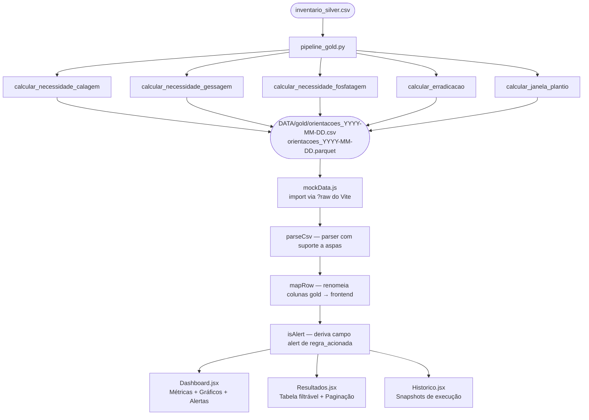

# Pipeline Gold e Integração com o Frontend — Sprint 3

**Última atualização:** 2026-06-11  
**Responsável:** Atvos G2  
**Integrantes:** Guilherme Ludovico, Guilherme, João Glauco, Gregory

---

## Visão Geral da Sprint 3

A Sprint 3 fechou o ciclo completo do projeto: os dados saem do inventário bruto, passam pelas regras agronômicas e chegam visíveis na tela para o usuário final. Para isso, duas frentes foram desenvolvidas em paralelo — o **Pipeline Gold**, que executa as regras sobre o inventário silver e produz as orientações por talhão, e o **Frontend**, uma interface React/Vite que consome esses dados e os exibe de forma navegável e filtrável.

O desafio central da sprint não foi técnico no sentido estrito, mas de integração: como fazer os dados reais do gold aparecerem no frontend sem criar dependências de infraestrutura desnecessárias? Essa decisão é documentada em detalhes na seção 4.

### Desvios do cronograma original

O cronograma original previa três entregas que não foram realizadas nesta sprint, por decisão deliberada do time:

| Entrega original | Situação | Motivo |
|---|---|---|
| Integração dos modelos de safra (Task 3.1) | ❌ Não realizada | O projeto opera sem BigQuery/GCP. A coluna `tchan_estimado` depende de fontes de dados na nuvem que não estão disponíveis no contexto local adotado desde a Sprint 1. |
| Módulo de insumos e doses — `insumos.py` (Task 3.3) | 🔄 Pendente | Não implementado em nenhuma branch até o momento. A ausência do `tchan_estimado` (dependente da Task 3.1) também bloquearia parte da lógica prevista. |
| Interface em Streamlit (Tasks 3.2, 3.4, 3.5) | ✅ Substituída | O time optou por React/Vite em vez de Streamlit — ver seção 6 para a justificativa. |

---

## 1. Pipeline Gold

### 1.1 Visão Geral

O pipeline gold é executado pelo script `src/pipeline_gold.py`. Ele lê o `inventario_silver.csv`, itera talhão a talhão, aplica as cinco regras agronômicas e gera um arquivo de orientações no formato longo — uma linha por par `(talhão, processo)`.

```python
# src/pipeline_gold.py
for _, row in df.iterrows():
    talhao = row.to_dict()
    resultado = {
        "id_talhao":    talhao.get("id_talhao"),
        "calagem":      calcular_necessidade_calagem(talhao),
        "gessagem":     calcular_necessidade_gessagem(talhao),
        "fosfatagem":   calcular_necessidade_fosfatagem(talhao),
        "erradicacao":  calcular_erradicacao(talhao),
        "janela_plantio": calcular_janela_plantio(talhao),
    }
```

Cada função de regra retorna um dicionário padronizado com três campos:

| Campo | Tipo | Descrição |
|---|---|---|
| `orientacao` | str | Texto descritivo para o agrônomo |
| `valor_calculado` | float \| None | Dose calculada (t/ha, kg/ha) ou `None` quando não aplicável |
| `regra_acionada` | str | Identificador da regra em snake_case — usado para filtros e alertas |

O pipeline foi executado em duas datas distintas (`2026-05-12` e `2026-05-22`), gerando dois snapshots na pasta `DATA/gold/`:

```
DATA/gold/
├── orientacoes_2026-05-12.csv
├── orientacoes_2026-05-12.parquet
├── orientacoes_2026-05-22.csv
└── orientacoes_2026-05-22.parquet
```

Cada snapshot tem aproximadamente **19.260 linhas** — 5 orientações (uma por processo) para cada talhão presente no silver.

### 1.2 Schema de Saída Gold

| Coluna | Tipo | Descrição | Exemplo |
|---|---|---|---|
| `id_talhao` | int | Identificador do talhão | `31` |
| `unidade` | int | Código da unidade industrial | `42` |
| `processo` | str | Nome do processo agronômico | `calagem` |
| `orientacao` | str | Texto da orientação gerada pela regra | `incorporada \| calcítico...` |
| `valor_calculado` | float | Dose ou valor numérico central da decisão | `0.34` |
| `regra_acionada` | str | Identificador da regra em snake_case | `calagem_incorporada` |
| `data_geracao` | date | Data de execução do pipeline | `2026-05-22` |

> **Formato longo:** cada talhão aparece cinco vezes no arquivo gold — uma linha por processo. Essa estrutura facilita filtros por processo e cálculos agregados, mas exige atenção ao contar talhões únicos (usar `id_talhao` distinto, não contagem de linhas).

### 1.3 Regras Implementadas

As cinco regras seguem a especificação do PDA ATVOS formalizada em pseudocódigo na Sprint 2. A tabela abaixo resume o estado de cada uma ao final da Sprint 3:

| Regra | Arquivo | Status | Campos do silver utilizados |
|---|---|---|---|
| Calagem (A.1) | `src/processing/rules.py` | ✅ Implementada | `V1`, `CTC1`, `mg1`, `categoria` |
| Gessagem (A.2) | `src/processing/rules.py` | ✅ Implementada | `ca2`, `al2`, `sb2`, `tipo_solo`, `categoria` |
| Fosfatagem (A.3) | `src/processing/rules.py` | ✅ Implementada | `p1`, `categoria` |
| Erradicação (B) | `src/processing/rules.py` | ✅ Implementada | `tch_prod`, `no_corte`, `sit_talhao`, `categoria` |
| Janela de plantio | `src/processing/rules.py` | 🔄 Parcial | `man_hipot` (perfil médio/precoce/tardio) |

> **Nota sobre a organização dos arquivos:** as regras completas e operacionais estão em `src/processing/rules.py`. O diretório `src/rules/` contém uma refatoração modular iniciada durante a sprint mas ainda em andamento — os arquivos individuais (`calagem.py`, `gessagem.py` etc.) retornam `PENDENTE` e **não são usados pela pipeline em produção**. O módulo ativo é `src/processing/rules.py`.

### 1.4 Valores de `regra_acionada` Produzidos

O campo `regra_acionada` é o identificador central do sistema. É a partir dele que o frontend decide o que é alerta e o que é informacional.

| Valor | Processo | Significado |
|---|---|---|
| `sem_necessidade_calagem` | calagem | V% adequado, sem ação |
| `calagem_incorporada` | calagem | Aplicação incorporada necessária |
| `sem_necessidade_gessagem` | gessagem | Ca e Al dentro dos limites |
| `gessagem_necessaria` | gessagem | Aplicação de gesso indicada |
| `sem_necessidade_fosfatagem` | fosfatagem | P disponível suficiente |
| `fosfatagem_muito_baixo` | fosfatagem | P < 6 mg/dm³, prioridade alta |
| `fosfatagem_baixo` | fosfatagem | P entre 6 e 12 mg/dm³, prioridade média |
| `nao_aplicavel_formacao` | erradicacao | Talhão em formação, erradicação não se aplica |
| `janela_media` | janela_plantio | Perfil médio — janela jan a mar |

---

## 2. Frontend

### 2.1 Estrutura

O frontend é uma aplicação React + Vite localizada em `views/`. A escolha por Vite foi mantida desde o início do projeto pela velocidade do servidor de desenvolvimento e pelo suporte nativo a imports modernos de ES modules.

```
views/
├── src/
│   ├── pages/
│   │   ├── Dashboard.jsx     # métricas, gráficos, talhões em alerta
│   │   ├── Resultados.jsx    # tabela paginada com filtros
│   │   └── Historico.jsx     # histórico de execuções do pipeline
│   ├── components/
│   │   ├── FilterBar.jsx     # filtros de unidade e processo
│   │   ├── ResultadosTable.jsx
│   │   ├── Pagination.jsx
│   │   ├── AlertIcon.jsx
│   │   ├── ImportModal.jsx
│   │   ├── Navbar.jsx
│   │   └── Tag.jsx
│   └── constants/
│       ├── mockData.js       # fonte central de dados (reescrita na Sprint 3)
│       └── theme.js          # paleta de cores
```

### 2.2 Páginas

**Dashboard** — visão executiva com quatro métricas calculadas a partir dos dados reais (total de talhões, talhões em alerta, percentual sem dado e processos avaliados), gráfico de barras com orientações por processo, gráfico de rosca preventiva vs. corretiva, e cards de alerta.

**Resultados** — tabela completa com paginação, filtros por unidade industrial e processo agronômico, e botão de exportação para CSV.

**Histórico** — registro das execuções do pipeline disponíveis em `DATA/gold/`. Exibe data, nome da execução, número de talhões únicos e processos avaliados.

---

## 3. Conexão Gold → Frontend

### 3.1 O Problema

No início da sprint, o frontend exibia dados fictícios de `mockData.js` — valores hardcoded que não tinham nenhuma relação com os arquivos produzidos pelo pipeline. A tarefa era substituir esses dados pelos reais do gold.

Três caminhos foram considerados:

| Abordagem | Como funciona | Por que foi descartada |
|---|---|---|
| **API (FastAPI/Flask)** | Backend Python serve os dados via HTTP; frontend faz `fetch` | Adiciona um servidor para manter; não faz sentido para projeto acadêmico sem deploy contínuo |
| **Copiar CSV para `views/public/`** | Arquivo servido estaticamente pelo Vite; frontend faz `fetch` | Cria redundância de dados — o mesmo arquivo em dois lugares; risco de dessincronia |
| **`?raw` import do Vite** | Vite lê o CSV no momento do build e embute o conteúdo no bundle JS | **Abordagem escolhida** |

### 3.2 A Abordagem Escolhida: Import `?raw`

O Vite oferece uma sintaxe especial de import que processa arquivos arbitrários em tempo de build, antes que qualquer código chegue ao browser:

```js
import rawCsv from '../../../DATA/gold/orientacoes_2026-05-22.csv?raw';
```

O sufixo `?raw` instrui o Vite a ler o arquivo como texto puro e embuti-lo diretamente no bundle JavaScript. O browser recebe o conteúdo já incorporado — sem chamada HTTP adicional, sem servidor, sem cópia do arquivo.

**Por que essa abordagem faz sentido aqui:**

O gold é gerado em execuções pontuais do pipeline, não em tempo real. Não existe razão para o frontend buscar o arquivo dinamicamente a cada requisição — os dados só mudam quando o pipeline roda novamente, o que exige rebuild de qualquer forma. O `?raw` é exatamente o mecanismo certo para esse padrão: dados que mudam por evento, não por tempo.

**Configuração necessária no Vite:**

Como o arquivo CSV está fora da pasta `views/` (raiz do projeto Vite), foi necessário liberar o acesso ao diretório pai em `vite.config.js`:

```js
export default defineConfig({
  plugins: [react()],
  server: {
    fs: {
      allow: ['..'],  // permite imports de DATA/gold/ durante o dev server
    },
  },
});
```

### 3.3 Parser CSV

O CSV gold contém campos com vírgulas internas (ex: `"na etapa da grade niveladora, antes do plantio"`), o que torna um `split(',')` simples incorreto. Um parser manual que respeita aspas foi implementado diretamente em `mockData.js`:

```js
function parseCsvLine(line) {
  const result = [];
  let current = '';
  let inQuotes = false;
  for (let i = 0; i < line.length; i++) {
    const ch = line[i];
    if (ch === '"')           { inQuotes = !inQuotes; }
    else if (ch === ',' && !inQuotes) { result.push(current); current = ''; }
    else                      { current += ch; }
  }
  result.push(current);
  return result;
}
```

### 3.4 Mapeamento de Colunas

As colunas do gold e do frontend têm nomes diferentes. O mapeamento é feito dentro da função `mapRow` em `mockData.js`:

| Coluna no gold | Campo no frontend | Observação |
|---|---|---|
| `id_talhao` | `id` | — |
| `unidade` | `unidade` | Código numérico (ex: `42`, `43`) |
| `processo` | `processo` | — |
| `orientacao` | `orientacao` | — |
| `valor_calculado` | `dose` | Exibido como "VALOR CALC." na tabela |
| `regra_acionada` | `regra` | — |
| `data_geracao` | `data` | — |
| *(ausente no gold)* | `alert` | Derivado — ver seção 3.5 |
| *(ausente no gold)* | `insumo` | Removido — não existe no gold |

> A coluna `insumo` existia no mock original mas não tem correspondência no gold. A decisão foi removê-la da tabela e dos filtros em vez de inventar um valor. Dados inventados na interface causam mais confusão do que uma coluna ausente.

### 3.5 Lógica de Alerta

O campo `alert` (booleano) não está no gold — é calculado pelo frontend a partir de `regra_acionada`. A regra é: **um talhão está em alerta se a regra indica uma ação real a ser tomada**.

```js
function isAlert(regra) {
  return (
    !regra.startsWith('sem_necessidade') &&
    !regra.startsWith('nao_aplicavel') &&
    !regra.startsWith('janela')
  );
}
```

| Prefixo | Interpretação | Gera alerta? |
|---|---|---|
| `sem_necessidade_*` | Parâmetros dentro dos limites, nenhuma ação necessária | ❌ Não |
| `nao_aplicavel_*` | Regra não se aplica ao tipo de talhão | ❌ Não |
| `janela_*` | Orientação informacional de calendário | ❌ Não |
| Qualquer outro | Ação agronômica necessária | ✅ Sim |

Talhões em alerta são destacados visualmente na tabela (linha com cor diferente) e aparecem nos cards da seção "Talhões em Alerta" do Dashboard.

---

## 4. Componentes Atualizados

### 4.1 `mockData.js`

Reescrito integralmente. Antes continha 20 registros fictícios com dados inventados. Agora importa e parseia os dois arquivos CSV do gold, exportando:

- `RESULTADOS` — todas as orientações mapeadas (~19.260 registros)
- `UNIDADES` e `PROCESSOS` — valores únicos derivados dos dados reais
- `BAR_DATA` — contagem de orientações por processo
- `PIE_DATA` — distribuição preventiva vs. corretiva
- `ALERT_CARDS` — primeiros 4 talhões com alerta
- `HISTORICO` — entradas derivadas das duas execuções do pipeline

### 4.2 `FilterBar.jsx`

O filtro por `insumo` foi removido (dado inexistente no gold). Os filtros restantes — unidade industrial e processo agronômico — passaram a usar as listas derivadas dos dados reais em vez de arrays hardcoded.

### 4.3 `ResultadosTable.jsx`

A coluna `INSUMO` foi removida. A coluna `DOSE KG/HA` foi renomeada para `VALOR CALC.`, refletindo com mais precisão o campo `valor_calculado` do gold, que pode representar tanto doses em kg/ha (fosfatagem) quanto em t/ha (calagem) ou kg/ha (gessagem).

### 4.4 `Dashboard.jsx`

As quatro métricas do painel passaram de valores estáticos para cálculos dinâmicos:

| Métrica | Antes | Depois |
|---|---|---|
| Total de Talhões | `"1.248"` (hardcoded) | `new Set(RESULTADOS.map(r => r.id)).size` |
| Talhões em Alerta | `"32"` (hardcoded) | `RESULTADOS.filter(r => r.alert).length` |
| % com Dado Ausente | `"14,6%"` (hardcoded) | Percentual de `valor_calculado` vazio |
| Processos Avaliados | `"18"` (hardcoded) | `new Set(RESULTADOS.map(r => r.processo)).size` |

### 4.5 `Pagination.jsx`

A paginação original exibia todos os números de página simultaneamente — impraticável com ~1.926 páginas (19.260 registros / 10 por página). Foi substituída por uma **janela deslizante de 5 páginas** centrada na página atual:

```js
const WINDOW = 5;
let start = Math.max(1, page - Math.floor(WINDOW / 2));
let end   = start + WINDOW - 1;
if (end > totalPages) {
  end   = totalPages;
  start = Math.max(1, end - WINDOW + 1);
}
```

**Comportamento:**

| Página atual | Páginas exibidas |
|---|---|
| 1 | 1 · 2 · 3 · 4 · 5 |
| 6 | 4 · 5 · **6** · 7 · 8 |
| Última (ex: 1926) | 1922 · 1923 · 1924 · 1925 · **1926** |

---

## 5. Fluxo Completo de Dados



---

## 6. Decisões de Arquitetura

### Por que React/Vite em vez de Streamlit?

O cronograma original previa Streamlit como interface de monitoramento. O time optou por React/Vite por três razões:

**Separação entre backend e frontend.** Streamlit mistura lógica de dados com lógica de apresentação no mesmo arquivo Python. Isso funciona bem para protótipos exploratórios, mas torna difícil evoluir a interface sem tocar no código de processamento. Com React, os dois ficam completamente separados: o pipeline Python produz o gold, o frontend consome.

**Controle visual.** Streamlit impõe um layout vertical e componentes pré-definidos. Para a interface da ATVOS — com cards de alerta, tabela paginada, gráficos side-by-side e paleta de cores da empresa — seria necessário usar `st.markdown` com HTML cru, que é um sinal de que a ferramenta errada foi escolhida. React dá controle total sobre o layout sem contorções.

**Familiaridade da equipe com o ecossistema JS.** O time tinha experiência prévia com React/Vite, o que reduziu o tempo de setup e evitou uma curva de aprendizado desnecessária para uma ferramenta que seria descartada após o projeto.

O único ponto em que Streamlit teria vantagem real aqui seria na leitura dinâmica de arquivos (sem necessidade de rebuild ao trocar o CSV). Essa limitação foi resolvida pela abordagem `?raw` descrita na seção 3.

---

### Por que não usar uma API?

A criação de uma API (FastAPI, Flask) foi o primeiro caminho considerado. Foi descartada porque adiciona um processo servidor que precisa estar rodando para o frontend funcionar — o que não é compatível com o contexto do projeto, onde o frontend é acessado abrindo um arquivo ou rodando `npm run dev`, sem infraestrutura permanente. Para projetos com dados atualizados em tempo real ou com múltiplos usuários simultâneos, uma API seria a escolha certa.

### Por que não copiar o CSV para `views/public/`?

Colocar o CSV em `views/public/` permitiria que o Vite o servisse via HTTP sem nenhuma configuração adicional. O problema é que cria duas cópias do mesmo arquivo: uma em `DATA/gold/` (fonte da verdade, gerada pelo pipeline) e outra em `views/public/` (cópia para o frontend). Qualquer nova execução do pipeline exigiria atualizar as duas, o que cria risco de dessincronia e confusão sobre qual versão é a correta.

### Por que `mockData.js` manteve o nome?

O arquivo foi reescrito integralmente mas não renomeado nesta sprint para evitar a necessidade de atualizar os imports em quatro arquivos simultaneamente. O nome `mockData.js` está desatualizado — o nome correto seria `goldData.js` — e essa renomeação foi identificada como pendência técnica a ser feita em uma próxima iteração.

---

## 7. Pendências Identificadas

| Item | Descrição | Prioridade |
|---|---|---|
| Renomear `mockData.js` | O arquivo serve dados reais mas o nome diz "mock" — confuso para o time técnico | Média |
| Implementar `insumos.py` (Task 3.3) | Módulo de gestão de insumos e doses previsto no cronograma ainda não foi desenvolvido em nenhuma branch | Alta |
| Finalizar `src/rules/` | Os módulos individuais em `src/rules/` retornam `PENDENTE`; a pipeline usa `src/processing/rules.py` | Alta |
| Atualizar `OUTPUT_PATH` no pipeline | `pipeline_gold.py` aponta para `../DATA/inventario_gold.csv` mas os arquivos reais estão em `DATA/gold/orientacoes_*.csv` | Alta |
| Criar `DATA/silver/` | O `inventario_silver.csv` está solto em `DATA/`; a arquitetura medalhão pede uma pasta `silver/` análoga à `gold/` | Baixa |
| `.gitignore` para `DATA/` | O `.gitignore` ignora `data/` (minúsculo) mas a pasta real é `DATA/` (maiúsculo). Em Linux isso não funciona — arquivos brutos grandes estão sendo versionados | Alta |
