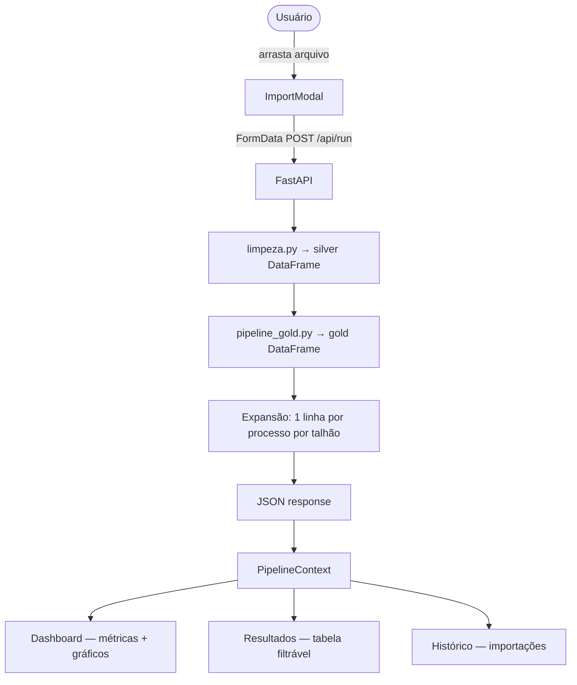

# Tarefa 4.3 — Integração Frontend + Backend via API

## Objetivo

Conectar o frontend React ao pipeline Python de forma que o usuário possa enviar um arquivo CSV ou XLSX pela interface, acionar toda a cadeia Silver → Gold e visualizar os resultados diretamente na tela — sem rebuild, sem cópia manual de arquivos.

---

## Contexto: Abordagem Anterior

A Sprint 3 documentou uma primeira abordagem de integração usando o import `?raw` do Vite: o CSV do gold era embutido no bundle JavaScript em tempo de build. Essa abordagem funciona bem para dados estáticos gerados por execuções pontuais do pipeline, mas tem uma limitação fundamental: **exige rebuild do frontend a cada nova execução do pipeline**, o que não é viável para uso recorrente pelo agrônomo.

A Sprint 4.3 substitui essa abordagem por uma API HTTP que serve como ponte em tempo de execução.

---

## Arquitetura

```
┌─────────────────────────────────────────────────┐
│                  USUÁRIO                         │
│   arrasta CSV/XLSX no modal "Importar Lista"     │
└────────────────────┬────────────────────────────┘
                     │ POST /api/run
                     ▼
┌─────────────────────────────────────────────────┐
│              api/main.py  (FastAPI)              │
│                                                 │
│  1. Lê o arquivo enviado (CSV ou XLSX)          │
│  2. Detecta formato: silver ou raw ATVOS        │
│  3. Executa limpeza.py  →  silver DataFrame     │
│  4. Executa pipeline_gold.py  →  gold DataFrame │
│  5. Expande gold: uma linha por (talhão, regra) │
│  6. Calcula métricas, gráficos e alertas        │
│  7. Persiste no histórico (historico.json)      │
│  8. Retorna JSON                                │
└────────────────────┬────────────────────────────┘
                     │ JSON
                     ▼
┌─────────────────────────────────────────────────┐
│           React  (views/)                       │
│                                                 │
│  PipelineContext atualiza estado global         │
│  Dashboard  →  métricas, gráficos, alertas      │
│  Resultados →  tabela filtrável                 │
│  Histórico  →  lista de importações             │
└─────────────────────────────────────────────────┘
```

---

## Componentes Criados

### `api/main.py` — Servidor FastAPI

Única responsabilidade: orquestrar o pipeline e traduzir seu resultado para o formato do frontend.

**Rotas:**

| Método | Rota | Descrição |
|---|---|---|
| `POST` | `/api/run` | Recebe arquivo + nome da lista, executa o pipeline completo, retorna JSON |
| `GET` | `/api/historico` | Retorna lista de importações salvas em `api/historico.json` |
| `GET` | `/api/health` | Liveness check — retorna `{"status": "ok"}` |

**Resposta de `/api/run`:**

```json
{
  "resultados": [
    {
      "id": "T001",
      "unidade": "UNIDADE_TESTE",
      "processo": "Calagem",
      "orientacao": "Aplicar 1.62 t/ha de calcário dolomítico...",
      "alert": false,
      "insumo": "-",
      "dose": "1.62",
      "regra": "calagem_necessaria_dolomítico",
      "data": "12/06/2026"
    }
  ],
  "metrics": {
    "total_talhoes": 542,
    "talhoes_alerta": 14,
    "pct_dado_ausente": 3.5,
    "processos_avaliados": 7
  },
  "bar_data": [{ "name": "Calagem", "value": 542 }, "..."],
  "pie_data": [
    { "name": "Preventiva", "value": 1200, "pct": "72.3%" },
    { "name": "Corretiva",  "value": 459,  "pct": "27.7%" }
  ],
  "alert_cards": [{ "id": "T002", "processo": "Erradicação", "orientacao": "..." }],
  "historico_entry": {
    "data": "12/06/2026",
    "nome": "Análise Solo — Junho 2026",
    "talhoes": 542,
    "processos": ["Calagem", "Dessecação", "Erradicação", "Fosfatagem", "Gessagem", "Insumo Fosfato", "Janela de Plantio"]
  }
}
```

**Detecção automática de formato:**

O endpoint aceita tanto o arquivo Excel bruto da ATVOS (colunas `TALHAO`, `UNID_IND`, etc.) quanto um CSV já no formato silver (com coluna `id_talhao`). A detecção é feita verificando a presença da coluna `id_talhao`:

```python
if "id_talhao" in df_raw.columns:
    df_silver = df_raw          # já é silver — pula limpeza
else:
    df_silver, _ = limpar_inventario(df_raw)   # arquivo bruto
    # join com análise de solo (se DATA/Dados_analise_solo.csv existir)
```

**Mapeamento de processos** — expansão do Gold:

Cada linha do Gold representa um talhão. A API expande para uma linha por processo, ignorando orientações `SEM_DADO` ou `NAO_APLICAVEL`:

| Coluna Gold | Processo exibido | Coluna dose |
|---|---|---|
| `calagem_orientacao` | Calagem | `calagem_dose_tha` |
| `gessagem_orientacao` | Gessagem | `gessagem_dose_kgha` |
| `fosfatagem_orientacao` | Fosfatagem | `fosfatagem_dose_kgha` |
| `erradicacao_orientacao` | Erradicação | `erradicacao_tch` |
| `janela_plantio_orientacao` | Janela de Plantio | — |
| `fosfato_orientacao` | Insumo Fosfato | `fosfato_dose_kg_ha` |
| `dessecacao_orientacao` | Dessecação | `dessecacao_dose_kg_ha` |

**Lógica de alerta:**

Um registro é marcado como alerta se sua orientação contém qualquer uma das palavras-chave:

```python
ALERT_KEYWORDS = ("reforma recomendada", "urgente", "imediatamente", "crítico", "alta prioridade")
```

---

### `views/src/context/PipelineContext.jsx` — Estado Global React

Armazena os dados do pipeline e expõe a função `runPipeline(file, nome)` para qualquer componente.

**Estado inicial:** dados mock de `mockData.js` — a interface funciona mesmo sem a API rodando.

**Ao importar:** o estado é substituído pelos dados reais retornados pela API.

```jsx
const { resultados, metrics, barData, pieData, alertCards, historico, isLoading, runPipeline } = usePipeline();
```

---

### `views/src/components/ImportModal.jsx` — Upload Real

O modal foi atualizado para:
- Aceitar `.csv`, `.xlsx` e `.xls` (`.parquet` removido — não suportado pelo pipeline)
- Enviar o arquivo via `FormData` para `POST /api/run`
- Exibir spinner de loading enquanto o pipeline processa
- Exibir mensagem de erro se a API retornar falha

---

## Proxy Vite

Para evitar CORS durante o desenvolvimento, o Vite foi configurado para redirecionar requisições `/api/*` para o servidor FastAPI:

```js
// views/vite.config.js
server: {
  proxy: {
    "/api": {
      target: "http://localhost:8000",
      changeOrigin: true,
    },
  },
}
```

Assim, o frontend faz `fetch("/api/run")` sem precisar conhecer a porta do backend.

---

## Fluxo Completo de Dados



---

## Ficheiro de Histórico

Cada importação bem-sucedida é persistida em `api/historico.json`. O arquivo é lido na inicialização do frontend via `GET /api/historico`, populando a aba Histórico com execuções anteriores:

```json
[
  {
    "data": "12/06/2026",
    "nome": "Análise Solo — Junho 2026",
    "talhoes": 542,
    "processos": ["Calagem", "Dessecação", "Erradicação", "Fosfatagem", "Gessagem", "Insumo Fosfato", "Janela de Plantio"]
  }
]
```

---

## Dependências Adicionadas

| Pacote | Versão | Motivo |
|---|---|---|
| `fastapi` | 0.115.5 | Framework da API |
| `uvicorn[standard]` | 0.32.1 | Servidor ASGI |
| `python-multipart` | 0.0.12 | Suporte a upload de arquivos no FastAPI |
| `openpyxl` | 3.1.5 | Leitura de `.xlsx` pelo pandas |

---

## Comparativo com a Abordagem Anterior

| Critério | Abordagem `?raw` (Sprint 3) | API FastAPI (Sprint 4.3) |
|---|---|---|
| Servidor adicional | Não (apenas Vite) | Sim (FastAPI + Vite) |
| Rebuild ao trocar dados | Sim | Não |
| Upload de arquivo pelo usuário | Não | Sim |
| Dados em tempo de execução | Não (embutidos no bundle) | Sim |
| Funciona sem API | Sim | Sim (fallback para mock) |
| Adequado para uso recorrente | Não | Sim |
